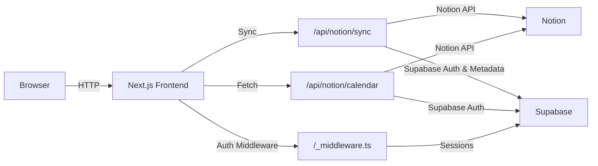

<div align="center">
  <a href="https://shipwrecked.hackclub.com/?t=ghrm" target="_blank">
    
  </a>
</div>

# bunni

Turn your Notion pages into a dynamic, interactive calendar.

## Overview

bunni is a full-stack web application built with Next.js that seamlessly connects to your Notion workspace and automatically pulls in assignments, assessments, and due dates into a clean weekly and monthly calendar. It uses Supabase for user authentication and session management, and implements serverless API routes to validate Notion databases and fetch calendar data.

Key components include a marketing landing page, a protected dashboard with calendar and synchronization interfaces, API routes for Notion integration, and session middleware to guard routes.

## Architecture



## Features

- OAuth-based Notion integration via Supabase Auth
- Configurable Notion parent page and calendar database synchronization
- Interactive weekly calendar view with horizontal scroll and date selection
- Quick task addition form with real-time syncing to Notion
- Checkbox-based completion tracking for tasks
- Secure, server-side API routes for validating and querying Notion databases
- Protected dashboard routes powered by custom Supabase session middleware
- Responsive landing page with features overview, FAQ, and call-to-action

## Installation

```bash
git clone https://github.com/dantewins/bunni.git
cd bunni
npm install
```

## Configuration

- Set environment variables in a `.env.local` file at the project root:
-   - `NEXT_PUBLIC_SUPABASE_URL`: Your Supabase project URL
-   - `NEXT_PUBLIC_SUPABASE_ANON_KEY`: Your Supabase anon/public API key
- Configure Notion OAuth in Supabase Dashboard under Authentication → Providers:
-   - Enable the Notion provider and set Redirect URL to `https://<your-domain>/api/notion/callback`

## Usage

- Run the development server: `npm run dev`
- Open `http://localhost:3000` in your browser
- On the landing page, click “Connect your Notion” to authenticate via Supabase OAuth
- In the dashboard, go to “Sync” to provide your Notion parent page ID and calendar database ID
- Navigate to “Calendar” to view and interact with your weekly task calendar

## Contributing

- Contributions are welcome! Please open an issue or submit a pull request.
- Follow the existing code style and ensure any new features include type definitions and validation where applicable.
- For major changes, discuss proposed enhancements via issue before implementing.

## Acknowledgements

- Next.js – React framework for production
- Supabase – Open source Firebase alternative for authentication and database
- ShadCN UI & Radix UI – Accessible component primitives
- Zod & React Hook Form – Schema validation and forms
- Tailwind CSS – Utility-first CSS framework
- Lucide-React – Icon library
- Sonner – Simple notifications library
